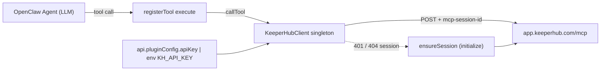

# OpenClaw KeeperHub plugin

## Goal

Create a standalone, ClawHub-publishable OpenClaw plugin at `openclaw-plugins/keepershub/` that mirrors the full feature set of [packages/plugin-keepershub](packages/plugin-keepershub) (26 tools wrapping the KeeperHub MCP API at `https://app.keeperhub.com/mcp`).

## Reference: what we are porting

The Eliza version registers 26 actions through [packages/plugin-keepershub/src/plugin.ts](packages/plugin-keepershub/src/plugin.ts), backed by:

- `KeeperHubService` ([packages/plugin-keepershub/src/service.ts](packages/plugin-keepershub/src/service.ts)) — MCP session manager (`initialize` -> `mcp-session-id` header -> `tools/call`), with auto re-init on `401` / `404 session` and JSON parse of `result.content[0].text`.
- `_helpers.ts` ([packages/plugin-keepershub/src/actions/_helpers.ts](packages/plugin-keepershub/src/actions/_helpers.ts)) — `extractId`, `extractJson`, `validationError`, and `handleToolCall` shape.
- 8 action files: `workflows.ts`, `execution.ts`, `templates.ts`, `plugins.ts`, `integrations.ts`, `protocol.ts`, `direct.ts`, `marketplace.ts`, `generate.ts`.

OpenClaw is a different runtime (no `runtime.getService(...)`, no `Action.handler`, no Eliza Memory), so the port is structural — semantics stay identical.

## Translation map (Eliza -> OpenClaw)

- `Action` with `validate` + `handler` -> `api.registerTool({ name, description, parameters, execute })` from [docs.openclaw.ai/plugins/sdk-overview](https://docs.openclaw.ai/plugins/sdk-overview.md).
- Free-form `extractId` / `extractJson` text parsing -> structured `Type.Object({...})` parameters from `@sinclair/typebox`. The LLM fills these directly, so we drop the regex layer entirely.
- `KeeperHubService` lifecycle -> module-level `KeeperHubClient` singleton inside `src/client.ts`, lazily initialized on the first tool call (no startup network I/O), keyed by `api.pluginConfig.apiKey ?? env`.
- Eliza `ActionResult` -> tool result shape `{ content: [{ type: "text", text }], isError? }`. On thrown errors we return `{ content, isError: true }` rather than throwing, matching OpenClaw tool-result diagnostics.
- `keeperhubContextProvider` -> a tiny `kh_status` tool the agent can call on demand (OpenClaw plugins don't have an Eliza-style provider that auto-injects into the system prompt; a status tool is the equivalent surface).

## Package layout

```
openclaw-plugins/keepershub/
  package.json                # @keepershub/openclaw-keepershub, openclaw block w/ extensions+compat+build
  openclaw.plugin.json        # id "keepershub", contracts.tools (all 26), activation.onStartup, configSchema (apiKey)
  tsconfig.json               # ESM, strict, "module": "ESNext"
  README.md                   # install + tool reference (port of existing README)
  src/
    index.ts                  # definePluginEntry registering all tools
    client.ts                 # KeeperHubClient (MCP session, ensureSession, postMcp, callTool)
    config.ts                 # resolveApiKey(api.pluginConfig, env)
    tools/
      _shared.ts              # toToolText(text), toToolError(err), runMcp helper
      workflows.ts            # 7 tools
      execution.ts            # 2 tools
      templates.ts            # 3 tools
      plugins.ts              # 3 tools
      integrations.ts         # 2 tools
      protocol.ts             # 2 tools
      direct.ts               # 4 tools
      marketplace.ts          # 2 tools
      generate.ts             # 2 tools (ai_generate, tools_documentation)
      status.ts               # kh_status (provider replacement)
    __tests__/
      client.test.ts          # mock fetch -> initialize, callTool happy path, session re-init on 401
      tools.test.ts           # parameter schemas, success+error response shapes
```

## Tool inventory (mirrors the 26 Eliza actions)

All tools registered as **required** (per chosen option). Names use a `kh_` prefix to avoid clashing with core OpenClaw tools.

- Workflows: `kh_list_workflows`, `kh_get_workflow`, `kh_create_workflow`, `kh_update_workflow`, `kh_delete_workflow`, `kh_execute_workflow`, `kh_search_org_workflows`
- Execution: `kh_get_execution_status`, `kh_get_execution_logs`
- Templates: `kh_search_templates`, `kh_get_template`, `kh_deploy_template`
- Plugin / schema: `kh_search_plugins`, `kh_get_plugin`, `kh_list_action_schemas`
- Integrations: `kh_list_integrations`, `kh_get_wallet_integration`
- Protocol: `kh_search_protocol_actions`, `kh_execute_protocol_action`
- Direct: `kh_execute_transfer`, `kh_execute_contract_call`, `kh_execute_check_and_execute`, `kh_get_direct_execution_status`
- Marketplace: `kh_search_workflows_marketplace`, `kh_call_workflow`
- Generate / docs / status: `kh_ai_generate_workflow`, `kh_tools_documentation`, `kh_status`

`kh_call_workflow` keeps the marketplace -> org-workflow fallback semantics from [packages/plugin-keepershub/src/actions/marketplace.ts](packages/plugin-keepershub/src/actions/marketplace.ts) (`looksLikeWorkflowId(slug)` -> retry via `execute_workflow`).

Each tool will be listed in `openclaw.plugin.json#contracts.tools`. Per the building-plugins doc, runtime-registered tools must appear there or OpenClaw won't discover the owning plugin.

## Key files (sketch)

[openclaw-plugins/keepershub/package.json](openclaw-plugins/keepershub/package.json):

```json
{
  "name": "@keepershub/openclaw-keepershub",
  "version": "1.0.0",
  "type": "module",
  "openclaw": {
    "extensions": ["./src/index.ts"],
    "runtimeExtensions": ["./dist/index.js"],
    "compat": { "pluginApi": ">=2026.3.24-beta.2", "minGatewayVersion": "2026.3.24-beta.2" },
    "build": { "openclawVersion": "2026.3.24-beta.2", "pluginSdkVersion": "2026.3.24-beta.2" }
  },
  "dependencies": { "@sinclair/typebox": "^0.34.0" },
  "peerDependencies": { "openclaw": ">=2026.3.24-beta.2" }
}
```

[openclaw-plugins/keepershub/openclaw.plugin.json](openclaw-plugins/keepershub/openclaw.plugin.json):

```json
{
  "id": "keepershub",
  "name": "KeeperHub",
  "description": "KeeperHub workflow automation: manage and execute on-chain workflows, monitor smart contracts, interact with DeFi protocols.",
  "activation": { "onStartup": true },
  "contracts": { "tools": ["kh_list_workflows", "kh_get_workflow", "..."] },
  "configSchema": {
    "type": "object",
    "additionalProperties": false,
    "properties": {
      "apiKey": { "type": "string", "description": "KeeperHub organization API key (starts with kh_)" }
    }
  },
  "uiHints": { "apiKey": { "label": "API key", "placeholder": "kh_...", "sensitive": true } }
}
```

[openclaw-plugins/keepershub/src/index.ts](openclaw-plugins/keepershub/src/index.ts) (skeleton):

```typescript
import { definePluginEntry } from "openclaw/plugin-sdk/plugin-entry";
import { registerWorkflowTools } from "./tools/workflows.js";
// ...other registrars

export default definePluginEntry({
  id: "keepershub",
  name: "KeeperHub",
  description: "KeeperHub workflow automation for OpenClaw",
  register(api) {
    registerWorkflowTools(api);
    registerExecutionTools(api);
    registerTemplateTools(api);
    registerPluginTools(api);
    registerIntegrationTools(api);
    registerProtocolTools(api);
    registerDirectTools(api);
    registerMarketplaceTools(api);
    registerGenerateTools(api);
    registerStatusTool(api);
  },
});
```

[openclaw-plugins/keepershub/src/client.ts](openclaw-plugins/keepershub/src/client.ts) ports the MCP transport from [packages/plugin-keepershub/src/service.ts](packages/plugin-keepershub/src/service.ts) verbatim (constants `MCP_URL`, `MCP_PROTOCOL_VERSION`, `headers()`, `ensureSession()`, `postMcp()` re-init on session expiry, `callTool()` with `JSON.parse(text)` fallback) but exposes a singleton `getClient(apiKey)` instead of an Eliza `Service`.

Example tool registration in [openclaw-plugins/keepershub/src/tools/workflows.ts](openclaw-plugins/keepershub/src/tools/workflows.ts):

```typescript
import { Type } from "@sinclair/typebox";

export function registerWorkflowTools(api: OpenClawPluginApi) {
  api.registerTool({
    name: "kh_list_workflows",
    description: "List all KeeperHub workflows in the organization. Optional filters: projectId, tagId.",
    parameters: Type.Object({
      projectId: Type.Optional(Type.String()),
      tagId: Type.Optional(Type.String()),
    }),
    async execute(_id, params) {
      return runMcp(api, "list_workflows", params, (result) => {
        const list = Array.isArray(result) ? result : [];
        if (!list.length) return "No workflows found in your KeeperHub organization.";
        return `Found ${list.length} workflow(s):\n\n` +
          list.map((w, i) => `${i + 1}. **${w.name ?? "Untitled"}** (ID: \`${w.id}\`) — ${w.enabled ? "enabled" : "disabled"}`).join("\n");
      });
    },
  });
  // create / update / delete / execute / search_org follow same pattern
}
```

`runMcp` (in `_shared.ts`) wraps `client.callTool(name, args)` and produces:

- success: `{ content: [{ type: "text", text: format(result) }] }`
- failure: `{ content: [{ type: "text", text: \`KeeperHub error: ${msg}\` }], isError: true }`

This matches the SDK contract that malformed tool results are reported as plugin diagnostics rather than crashing the agent.

## Architecture



## Test plan (bun:test, mirrors `packages/plugin-keepershub/src/__tests__/`)

- `client.test.ts`: mock global `fetch` -> verify `initialize` -> `mcp-session-id` capture -> `tools/call` body -> 401 triggers re-init then succeeds -> JSON parse of `result.content[0].text`.
- `tools.test.ts`: for representative tools (`kh_list_workflows`, `kh_execute_workflow`, `kh_call_workflow` fallback), inject a fake client and assert response `content[0].text` and `isError` for thrown vs returned errors.

## Out of scope

- ClawHub publishing automation (the plan produces the package; `clawhub package publish` is a separate user step covered in the README).
- Approval gating (`before_tool_call`) — explicitly declined per the chosen option of registering all tools as required.
- Hooks, channel registration, providers — not needed for this plugin's purpose.
