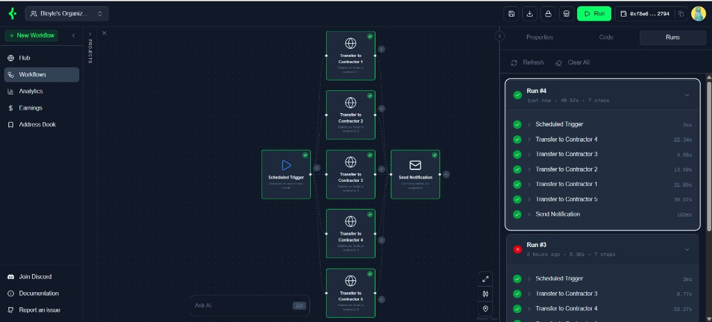

<div align="center">
  <h1>Keepers Eliza Plugin</h1>
  <p><strong>Umbrella repo: ElizaOS platform + KeeperHub plugin, plus OpenClaw and Hermes plugin packages</strong></p>
  <p>Use <a href="https://app.keeperhub.com">KeeperHub</a> from agents via MCP. The <strong>ElizaOS</strong> stack lives under <code>Eliza/</code>; <strong>OpenClaw</strong> and <strong>Hermes</strong> integrations live in sibling directories at the repo root for their respective CLIs and publish targets.</p>
</div>

<div align="center">
  <a href="https://github.com/Bleyle823/Keepers-Eliza-Plugin/blob/main/LICENSE"></a>
  <a href="https://docs.elizaos.ai/"></a>
  <a href="https://docs.openclaw.ai/"></a>
</div>

---

## What this repository is

This repository groups **[KeeperHub](https://app.keeperhub.com)** integrations for three agent stacks. All three talk to KeeperHub over **HTTPS MCP** at `https://app.keeperhub.com/mcp` using an organisation API key (`kh_…`); they differ by host runtime (ElizaOS vs OpenClaw vs Hermes).

### Layout and packages

| Stack | Path in this repo | Published / install identity |
| --- | --- | --- |
| **ElizaOS** (upstream-style monorepo + plugin) | [`Eliza/`](Eliza) — plugin [`Eliza/packages/plugin-keepershub`](Eliza/packages/plugin-keepershub) | **`@elizaos/plugin-keeperhub`** (npm) |
| **OpenClaw** | [`openclaw-plugins/keepershub`](openclaw-plugins/keepershub) | **`openclaw-keepershub`** (npm); **[ClawHub](https://docs.openclaw.ai/tools/clawhub)** **`@keepershub/openclaw-keepershub`** for `openclaw plugins install …` |
| **Hermes** | [`hermes-plugins/keepershub`](hermes-plugins/keepershub) | **`hermes-plugin-keepershub`** ([`pyproject.toml`](hermes-plugins/keepershub/pyproject.toml)) |

### Capability overview

| Surface | Purpose |
| --- | --- |
| **ElizaOS** | KeeperHub MCP as **Eliza actions** + service + context provider |
| **OpenClaw** | **`openclaw-keepershub`** — **28 typed `kh_*` tools** (TypeBox), Gateway-friendly |
| **Hermes** | Python plugin — **28 `kh_*` tools** aligned with OpenClaw (TUI / Telegram / other Hermes channels) |

### Try the plugins (hosted demos)

These links are an **easy on-ramp** to see each integration in action—no local install required for a first chat or click-through.

| Surface | Try it |
| --- | --- |
| **Eliza** (web client) | [ElizaOS client on Phala dstack](https://59ac278dbb08744b118f4f9c382ade7cfd0f508e-3000.dstack-pha-prod5.phala.network/) |
| **Hermes** (Telegram) | [@keeperhermes2_bot](https://t.me/keeperhermes2_bot) |
| **OpenClaw** (Telegram) | [@keeperHub2_bot](https://t.me/keeperHub2_bot) (**Keeps**) |

**Personalised or production use** (your org, API keys, characters, Gateway, and infra) still means **setting up your own** Eliza, Hermes, or OpenClaw stack using the integration sections below—you cannot rely on shared demo hosts for customised workflows, credentials, or uptime.

---

## Features (KeeperHub)

- **Workflows** — list, create, update, delete, execute, search; AI-assisted generation where supported
- **Execution** — status and logs for workflow runs
- **Templates** — search, inspect, deploy into your org
- **DeFi & protocols** — discover and run protocol-oriented actions (e.g. Aave, Chainlink, Morpho, Uniswap, and others supported by KeeperHub)
- **Direct on-chain** — transfers, contract calls, conditional flows via configured wallet integrations
- **Marketplace** — search and invoke listed workflows (with sensible org fallbacks where applicable)
- **Integrations & schemas** — list integrations, wallet details, and action/plugin metadata

Detailed tool and action tables live in each plugin’s README (linked below).

---

## Case study: salary distribution on Base Sepolia from Eliza



This example shows a **[KeeperHub](https://app.keeperhub.com) workflow** used together with **`@elizaos/plugin-keeperhub`**. The automation was designed in KeeperHub’s node editor: a **scheduled trigger** (runs at the start of each month) fans out into **five parallel native transfers**—one per contractor—and finishes with **Send Notification** once distribution completes. The **Runs** pane records each step so you get timing and outcomes without touching an explorer until you want receipts.

Five successful **Base Sepolia** transfers from that pattern are visible on [BaseScan Sepolia](https://sepolia.basescan.org/), for example:

| Transfer | Explorer |
| --- | --- |
| 1 | [Transaction `0xd289…fee8c`](https://sepolia.basescan.org/tx/0xd289ee29ef350fd3d30c0d180bb25b615b5b3f2b67783b60e8bb4702073fee8c) |
| 2 | [Transaction `0x037e…c2a7`](https://sepolia.basescan.org/tx/0x037efa2d26cc1c392bffc333a5b5cae0e9040aa2c9bd0bda0cbfade1c437c2a7) |
| 3 | [Transaction `0xce42…31e9`](https://sepolia.basescan.org/tx/0xce4296f4d46b07de59f7292c0186a3f7165c3d347f43f279980ab78cbc5f31e9) |
| 4 | [Transaction `0xe6f1…b1b7`](https://sepolia.basescan.org/tx/0xe6f1964e15f89988abbb37b075c1fde68ba027ec70a3184b335bf0f6f727b1b7) |
| 5 | [Transaction `0x1332…4bb`](https://sepolia.basescan.org/tx/0x133228870b4e001771bf7ab3e8908bf64a69a1fa7c4514ec760b6271a26d24bb) |

**Where Eliza fits.** You keep design, scheduling, and custody in KeeperHub (visual graph, organisation wallet integration, execution logs). From chat, Eliza invokes **KeeperHub actions**: list workflows, inspect runs, trigger execution when needed, and troubleshoot—instead of owning raw RPC wiring, nonce management across parallel sends, retries, or bespoke scripts for each payout lane.

**Why not “plain Eliza”?** Delivering five concurrent testnet payouts on a cadence—with verified hashes, sane error handling, and reproducible orchestration—is slow and brittle if you bolt **EVM wallets, multicall choreography, receipt polling, and human-readable status** entirely into Eliza prompts and custom code. The plugin routes that surface area through **KeeperHub’s MCP-backed workflow engine**, so the agent stays in natural language while execution stays deterministic and observable.

---

## Repository layout

```
├── Eliza/                          # ElizaOS monorepo (bun install / build / elizaos — run commands here)
│   ├── packages/
│   │   └── plugin-keepershub/    # @elizaos/plugin-keeperhub
│   ├── index.ts                    # Optional sample “Keeper” character wiring the plugin
│   ├── docker-compose.phala.yaml   # Optional Phala-oriented compose
│   └── scripts/
│       └── deploy-phala.ps1        # Example Phala deploy helper (PowerShell)
├── openclaw-plugins/
│   └── keepershub/               # OpenClaw plugin package (npm / ClawHub)
└── hermes-plugins/
    └── keepershub/               # Hermes Python plugin (pip / PyPI)
```

The bulk of `Eliza/packages/` is standard ElizaOS platform code (CLI, server, client, core, etc.). Upstream behaviour is documented at [docs.elizaos.ai](https://docs.elizaos.ai/).

---

## Prerequisites

**ElizaOS tree (`Eliza/` + `@elizaos/plugin-keeperhub`):**

- **[Bun](https://bun.sh/docs/installation)** (`Eliza/` pins a `packageManager`; see [`Eliza/package.json`](Eliza/package.json))
- **Node.js** compatible with `Eliza/package.json` `engines` (currently **23.x**)

**OpenClaw:** Gateway/CLI and config per [OpenClaw documentation](https://docs.openclaw.ai/). Consume **`openclaw-plugins/keepershub`** from this repo or from npm / ClawHub.

**Hermes:** Hermes Agent, Python **3.9+** (confirm against your Hermes version), plugins directory — [`hermes-plugins/keepershub/README.md`](hermes-plugins/keepershub/README.md).

> **Windows:** Upstream ElizaOS often recommends **WSL 2** for the full CLI/dev experience. Native Windows may work for parts of the stack; use WSL if you hit tooling issues.

---

## Developers: clone and run the ElizaOS monorepo

```bash
git clone https://github.com/Bleyle823/Keepers-Eliza-Plugin.git
cd Keepers-Eliza-Plugin/Eliza

bun install
bun run build
```

Useful commands (from **`Eliza/`**):

```bash
# Run tests (Turbo; excludes some heavy starters per root script)
bun run test

# Focus tests on the KeeperHub Eliza package
cd packages/plugin-keepershub && bun test && cd ../..

# Format / lint (as configured in the monorepo)
bun run format
bun run lint
```

KeeperHub Eliza plugin developer notes and manual test ideas: [`Eliza/packages/plugin-keepershub/TESTING_GUIDE.md`](Eliza/packages/plugin-keepershub/TESTING_GUIDE.md).

For OpenClaw (`bun test`, `tsc`) or Hermes (`pytest`), run tooling inside [`openclaw-plugins/keepershub`](openclaw-plugins/keepershub) or [`hermes-plugins/keepershub`](hermes-plugins/keepershub) respectively.

---

## Clone plugin trees and publish

### Full clone

```bash
git clone https://github.com/Bleyle823/Keepers-Eliza-Plugin.git
cd Keepers-Eliza-Plugin
```

### Sparse checkout (one plugin folder)

```bash
git clone --filter=blob:none --no-checkout https://github.com/Bleyle823/Keepers-Eliza-Plugin.git keeperhub-plugins
cd keeperhub-plugins
git sparse-checkout init --cone
# Choose one:
git sparse-checkout set openclaw-plugins/keepershub
# git sparse-checkout set hermes-plugins/keepershub
# git sparse-checkout set Eliza
git checkout main
```

Use a full **`Eliza/`** checkout for ElizaOS platform work; sparse-checkout of only `Eliza/packages/plugin-keepershub` leaves out most workspace packages.

### Publish ElizaOS (`@elizaos/plugin-keeperhub`)

1. Complete setup under [`Eliza/`](Eliza) (`bun install`, `bun run build`).
2. Bump `version` in [`Eliza/packages/plugin-keepershub/package.json`](Eliza/packages/plugin-keepershub/package.json) (or use Lerna version scripts from **`Eliza/`**: `bun run version:patch`, `version:beta`, etc.).
3. Publish using the ElizaOS monorepo release flow from **`Eliza/`**: `bun run release`, `release:beta`, or `release:alpha` (Lerna `from-package`), matching how upstream ElizaOS ships packages.

Consumers install with `bun add @elizaos/plugin-keeperhub` / `npm install @elizaos/plugin-keeperhub`.

### Publish OpenClaw (npm / ClawHub)

From [`openclaw-plugins/keepershub`](openclaw-plugins/keepershub):

```bash
cd openclaw-plugins/keepershub
bun install
bun run build    # also runs via prepublishOnly on publish
npm publish      # package name: openclaw-keepershub — see package.json
```

For registry publication on **ClawHub** so users can `openclaw plugins install @keepershub/openclaw-keepershub`, follow [OpenClaw ClawHub docs](https://docs.openclaw.ai/tools/clawhub) and [`openclaw-plugins/keepershub/README.md`](openclaw-plugins/keepershub/README.md).

### Publish Hermes (PyPI)

From [`hermes-plugins/keepershub`](hermes-plugins/keepershub):

```bash
cd hermes-plugins/keepershub
pip install build twine
# bump version in pyproject.toml
python -m build
twine upload dist/*
```

This publishes **`hermes-plugin-keepershub`** with the `hermes_agent.plugins` entry point declared in [`pyproject.toml`](hermes-plugins/keepershub/pyproject.toml).

---

## KeeperHub API key

Create an organisation API key in the KeeperHub app: [app.keeperhub.com](https://app.keeperhub.com) → **Avatar → API Keys → Organisation → New API Key**.

Set one of (the Eliza plugin and both portable plugins accept these names in their respective environments):

```env
KH_API_KEY=kh_your_key_here
# aliases also supported:
# KEEPERHUB_API_KEY=...
# KEEPERSHUB_API_KEY=...
```

Never commit real keys. Use `.env` / your host’s secret store. [`Eliza/.gitignore`](Eliza/.gitignore) excludes `.env` and similar patterns for the ElizaOS tree.

---

## Integrating the ElizaOS plugin (`@elizaos/plugin-keeperhub`)

**Use this path when you run agents from [`Eliza/`](Eliza) or install from npm.** Register **`@elizaos/plugin-keeperhub`** on your ElizaOS runtime / character `plugins` array.

**1. Workspace / path dependency (this repo)**

The package lives at [`Eliza/packages/plugin-keepershub`](Eliza/packages/plugin-keepershub). In another package or app inside **`Eliza/`**, depend on it via `workspace:*` or your monorepo’s linking rules.

**2. Published NPM (consumers outside this repo)**

```bash
bun add @elizaos/plugin-keeperhub
```

**3. Register the plugin and secrets**

- Add **`KH_API_KEY`** to the agent environment (or your deployment secrets manager).
- Register the plugin on your agent runtime / character `plugins` array.

Minimal pattern:

```typescript
import keeperhubPlugin from '@elizaos/plugin-keeperhub';

// When building AgentRuntime / character config:
plugins: [
  // ...other plugins
  keeperhubPlugin,
],
```

**4. Character strings**

Point the model at KeeperHub for workflow and on-chain tasks in `system` / `bio` if you want consistent routing (see [`Eliza/index.ts`](Eliza/index.ts) for a sample **“Keeper”** character that adds `@elizaos/plugin-keeperhub` and KeeperHub-oriented prompts).

Full action list and examples: [`Eliza/packages/plugin-keepershub/README.md`](Eliza/packages/plugin-keepershub/README.md).

---

## Integrating the OpenClaw plugin (`openclaw-keepershub`)

Use OpenClaw’s Gateway and CLI (`openclaw.json`, env, etc.) as described in [OpenClaw plugin docs](https://docs.openclaw.ai/tools/plugin). Recommended install is **`openclaw plugins install @keepershub/openclaw-keepershub`** or **`npm:@keepershub/openclaw-keepershub`** / **`clawhub:@keepershub/openclaw-keepershub`** — see [`openclaw-plugins/keepershub/README.md`](openclaw-plugins/keepershub/README.md).

**From a checkout of this repo:**

1. Ensure **`openclaw-plugins/keepershub`** exists on disk (full clone or sparse checkout above).
2. On the **machine and working directory where you manage OpenClaw** (your OpenClaw project / install), install the plugin by pointing OpenClaw at that directory. Example — adjust `PATH_TO_REPO` to where you cloned **this** repo (or move the folder next to your OpenClaw config):

```bash
# Run from YOUR OpenClaw context; PATH_TO_REPO/openclaw-plugins/keepershub must exist on that machine.
openclaw plugins install PATH_TO_REPO/openclaw-plugins/keepershub
openclaw gateway restart
```

**Configure the API key** in **that** OpenClaw environment (OpenClaw config or env — see plugin doc):

```bash
openclaw config set plugins.entries.keepershub.config.apiKey "kh_your_key_here"
# or rely on KH_API_KEY / KEEPERHUB_API_KEY / KEEPERSHUB_API_KEY
```

**Verify:**

```bash
openclaw plugins inspect keepershub --runtime --json
```

Then have the agent call **`kh_status`**.

Complete install options (npm / ClawHub), tool table, architecture, and publishing: [`openclaw-plugins/keepershub/README.md`](openclaw-plugins/keepershub/README.md) and [OpenClaw plugin docs](https://docs.openclaw.ai/tools/plugin).

---

## Integrating the Hermes plugin

Install into **[Hermes Agent](https://hermes-agent.nousresearch.com/)** using its plugins directory and CLI. Source for this integration: [`hermes-plugins/keepershub`](hermes-plugins/keepershub).

1. Obtain **`hermes-plugins/keepershub`** from a clone or archive of **this repository** (or **`pip install hermes-plugin-keepershub`** after it is published—see [Publish Hermes (PyPI)](#publish-hermes-pypi)).
2. On the host where Hermes runs, install into Hermes’s plugin location (adapt paths if your distro uses another plugins root):

**Directory install (typical):**

```bash
# PATH_TO_REPO = where you cloned this repo on the Hermes machine
cp -r PATH_TO_REPO/hermes-plugins/keepershub ~/.hermes/plugins/keepershub
hermes plugins enable keepershub
```

**Editable pip install** (optional — for hacking on the plugin; still use Python/Hermes on **that** side):

```bash
cd PATH_TO_REPO/hermes-plugins/keepershub
pip install -e ".[dev]"
```

**Environment:** `plugin.yaml` declares **`KH_API_KEY`**. Hermes can prompt on `hermes plugins install` and store values in Hermes’s **`.env`**.

**Tests** (developers, from a checkout of this repo):

```bash
cd hermes-plugins/keepershub
pytest
```

Details: [`hermes-plugins/keepershub/README.md`](hermes-plugins/keepershub/README.md).

---

## Optional: Phala and Docker

Paths below are under **`Eliza/`**:

- **`Eliza/docker-compose.phala.yaml`** — compose stack oriented toward Phala deployment; adjust images and secrets for your environment.
- **`Eliza/scripts/deploy-phala.ps1`** — PowerShell helper to drive a deploy flow; review and edit paths and remotes before use.
- **`Eliza/Dockerfile`** / **`bun run docker:*`** — follow [`Eliza/package.json`](Eliza/package.json) scripts and upstream ElizaOS Docker patterns where applicable.

---

## Contributing and issues

- Use the templates under [`Eliza/.github/ISSUE_TEMPLATE`](Eliza/.github/ISSUE_TEMPLATE) for bugs and features affecting the ElizaOS tree.
- For **KeeperHub plugin** changes, prefer focused PRs scoped to `Eliza/packages/plugin-keepershub`, `openclaw-plugins/keepershub`, or `hermes-plugins/keepershub` with tests when possible.

---

## Upstream and credits

The **`Eliza/`** directory **tracks [ElizaOS](https://github.com/elizaos/eliza)** (monorepo layout, CLI, server, client, ecosystem packages). The **KeeperHub Eliza plugin** is **`Eliza/packages/plugin-keepershub`**. **OpenClaw** and **Hermes** KeeperHub packages live alongside **`Eliza/`** at the repository root for npm / ClawHub and PyPI workflows respectively.

If you cite Eliza in research, see the upstream [README](https://github.com/elizaos/eliza) for the recommended BibTeX entry.

---

## License

This project is licensed under the **MIT License**. See the [`LICENSE`](LICENSE) file for details.
